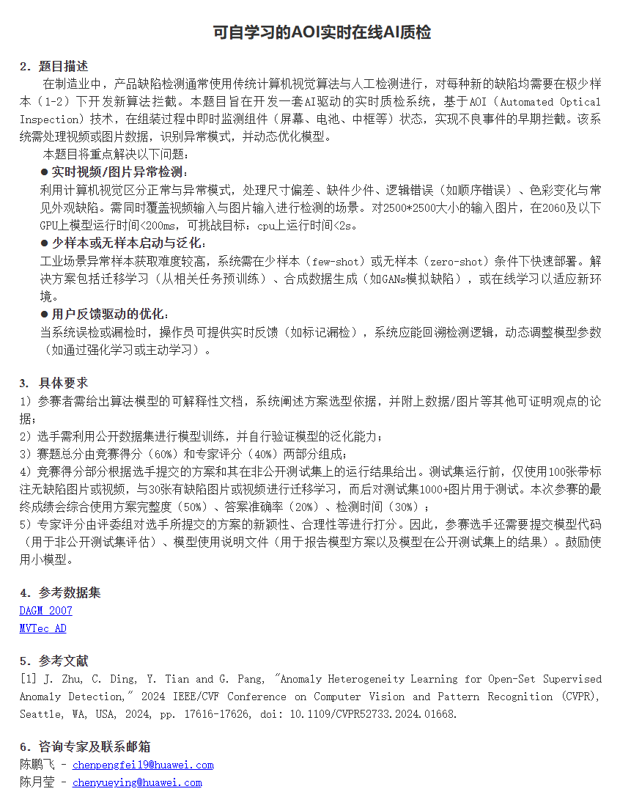

# AOI — Automatic Optical Inspection

面向工业产线的实时 AI 质检系统，重点解决以下三个问题：

1. **实时图片与视频异常检测**
2. **少样本或无异常样本条件下的新产线快速启动**
3. **用户反馈驱动的安全持续优化**

系统面向划痕、裂纹、污点、崩边、颜色偏差、尺寸变化、组件缺失、装配异常和工序逻辑异常等多种 AOI 场景。

---

## 1. 项目目标

传统工业质检通常依赖人工目检或固定规则机器视觉系统，存在以下问题：

| 挑战 | 说明 |
|---|---|
| 实时性要求高 | 2500×2500 高分辨率图像需要在产线节拍内完成检测 |
| 缺陷样本稀缺 | 新产品上线时通常只有约 100 张正常图和 30 张异常图 |
| 未见缺陷难以覆盖 | 测试阶段可能出现训练阶段从未出现过的异常类型 |
| 异常类型异质 | 外观、颜色、几何、组件、装配和时序异常不能由单一分数完整描述 |
| 用户反馈更新存在风险 | 直接在线更新容易造成模型漂移和正常模式污染 |

本项目采用 ConvNeXt 多尺度视觉特征、开放集异常训练、目标产线少样本适配、异质异常增强和反馈安全更新，构建完整的 AOI 检测流程。

题目描述：



---

## 2. 赛题约束

当前方案按照以下部署条件设计：

- 输入支持图片和视频；
- 原始工业图像分辨率可达到约 2500×2500；
- RTX 2060 或以下 GPU 单图推理目标小于 200 ms；
- CPU 单图推理目标小于 2 s；
- 新产线适配阶段允许使用：
  - 100 张正常样本；
  - 30 张异常样本；
- 完成迁移后，在后续 1000+ 测试样本上冻结模型；
- 测试数据不加入训练集，不更新模型参数；
- 用户反馈只在独立更新阶段使用；
- 反馈模型必须通过历史回放、验证和回滚检查后再发布。

---

## 3. 使用的数据集

离线工业训练使用以下四个公开数据集：

| 数据集 | 主要内容 | 在本项目中的作用 |
|---|---|---|
| MVTec AD | 15 类工业对象和纹理异常 | 划痕、裂纹、污点、缺口和局部外观缺陷 |
| DAGM 2007 | 10 类工业纹理缺陷 | 细粒度纹理异常和小面积缺陷 |
| VisA | 12 类复杂工业对象 | 外观异常、多组件异常和电子元件异常 |
| MVTec LOCO AD | 5 类结构和逻辑异常 | 缺件、多件、错位、错误组合和逻辑异常 |

数据目录：

```text
data/
├── mvtec_ad/
├── dagm2007/
├── visa/
└── mvtec_loco_ad/
```

四个数据集共同用于：

- 公共工业预训练；
- 跨类别异常泛化训练；
- 已见异常与未见异常划分；
- 纹理、颜色、几何和组件异常训练；
- 后续 0/1/2/5/30-shot 开放集 episode 构造。

---

## 4. 系统整体流程

```text
┌─────────────────────────────────────────────┐
│ 阶段一：公共工业数据训练                     │
│                                             │
│ MVTec AD                                    │
│ DAGM 2007                                   │
│ VisA                                        │
│ MVTec LOCO AD                               │
│                                             │
│ 学习通用局部纹理、全局结构和工业异常特征     │
└───────────────────┬─────────────────────────┘
                    │
                    │ industrial_pretrained.pth
                    ▼
┌─────────────────────────────────────────────┐
│ 阶段二：目标产线少样本适配                   │
│                                             │
│ 100 张正常样本                               │
│ 30 张真实异常样本                            │
│ 纹理 / 颜色 / 几何 / 组件合成异常            │
│                                             │
│ 更新轻量任务头、正常性参数和融合参数         │
└───────────────────┬─────────────────────────┘
                    │
                    │ target_model.pth
                    │ normal_reference.pth
                    ▼
┌───────────────────┬─────────────────────────┐
│                   │                         │
▼                   ▼                         ▼
实时图片检测         实时视频检测              用户反馈优化
F16/F32 多尺度       帧级异常检测              反馈样本缓存
单次骨干前向         状态机接口                安全重训
异常图与异常分数     时序模型接口              验证与回滚
```

---

## 5. 骨干网络

### 5.1 当前可运行模型

当前代码使用：

```text
ConvNeXtV2-Tiny-384
```

输入尺寸：

```text
B × 3 × 384 × 384
```

核心多尺度特征：

```text
F16：B × 384 × 24 × 24
F32：B × 768 × 12 × 12
```

当前使用 ConvNeXtV2-Tiny 的原因：

- 参数量较小；
- 预训练权重已经成功加载；
- 已完成公共训练、目标迁移和实际延迟测试；
- 适合 RTX 2060 等低算力设备；
- 能为局部检测、全局检测和视频逻辑分支保留计算预算。

### 5.2 ConvNeXt-L 的定位

项目中同时保留公开可用的 ConvNeXt-L 预训练权重：

```text
model/convnext_large_22k_1k_224.pth
```

ConvNeXt-L 后续可用于：

- 更强的离线工业预训练；
- 教师模型；
- 特征蒸馏；
- 与 ConvNeXtV2-Tiny 进行精度对比；
- 验证更大骨干是否能够提升未见异常泛化。

当前实测结果均来自 ConvNeXtV2-Tiny，不能将 ConvNeXt-L 的精度或延迟作为已验证结果。

---

## 6. F16/F32 多尺度主线

F16 和 F32 是当前方案不可删除的两条核心分支。

### 6.1 F16 局部外观分支

F16 特征尺寸：

```text
F16 ∈ R^(B × 384 × 24 × 24)
```

F16 具有较高空间分辨率，主要处理：

- 划痕；
- 裂纹；
- 污点；
- 崩边；
- 小孔洞；
- 局部纹理破坏；
- 局部色差；
- 小面积未见外观异常。

当前局部头：

```text
F16
→ local_head
→ 24×24 局部异常图
→ Top-K 聚合
→ 局部异常分数
```

### 6.2 F32 全局结构分支

F32 特征尺寸：

```text
F32 ∈ R^(B × 768 × 12 × 12)
```

F32 具有更大的感受野，主要处理：

- 整体结构异常；
- 大范围异常；
- 组件缺失；
- 组件数量变化；
- 装配错误；
- 全局颜色变化；
- 几何形态变化；
- 逻辑结构异常。

当前 F32 接入：

```text
F32
├── global_head
├── component_head
├── geometry_head
├── domain_head
└── fusion_head
```

---

## 7. 当前模型结构

当前 `aoi_model.py` 的基础结构：

```text
输入图像：384×384
        │
        ▼
ConvNeXtV2-Tiny
        │
        ├── F16
        │    └── local_head
        │         ├── local_map
        │         ├── local_mean_score
        │         └── local_top_score
        │
        └── F32
             ├── global_head
             ├── component_head
             ├── geometry_head
             ├── domain_head
             └── fusion_head
```

各分支职责：

| 分支 | 作用 |
|---|---|
| `local_head` | 局部外观缺陷和异常热力图 |
| `global_head` | 图像级整体异常分类 |
| `component_head` | 组件状态和结构异常接口 |
| `geometry_head` | 几何变化和尺寸异常接口 |
| `domain_head` | 真实异常与合成异常域对齐 |
| `fusion_head` | 多分支异常分数融合 |
| `TemporalLogicHead` | 视频状态序列建模接口 |

需要注意：

- `component_head` 必须结合组件标签、组件 Mask、组件框或可控组件异常合成进行训练；
- `geometry_head` 必须定义明确的几何监督目标；
- 仅定义输出头不能证明模型已经具备完整的缺件或尺寸检测能力。

---

## 8. 当前强基线：F16 局部记忆检索

当前已经跑通的强基线使用：

```text
F16 局部 Token
→ 正常 Token 库
→ GPU 最近邻距离
→ Top-1% 最大距离均值
```

正常参考包括：

| 参考类型 | 特征来源 | 方法 |
|---|---|---|
| 局部参考 | F16 局部 Token | GPU 最近邻距离 |
| 全局参考 | F32 全局池化特征 | Ledoit-Wolf + Mahalanobis |
| 颜色参考 | LAB 颜色统计 | Ledoit-Wolf + Mahalanobis |
| 几何参考 | 边缘和轮廓特征 | Ledoit-Wolf + Mahalanobis |

GPU 最近邻距离使用以下等价分解：

```text
distance²(x, y)
=
||x||²
+
||y||²
-
2 × x · y
```

对应代码：

```python
for start in range(0, bank.shape[0], chunk_size):
    bank_chunk = bank[start:start + chunk_size]
    bank_norm_chunk = bank_sq_norm[start:start + chunk_size]

    distances = (
        token_sq_norm
        + bank_norm_chunk.unsqueeze(0)
        - 2.0 * torch.matmul(tokens, bank_chunk.T)
    )

    minimum_distance = torch.minimum(
        minimum_distance,
        distances.min(dim=1).values,
    )
```

该实验已经证明：

> F16 局部正常性建模是未见局部缺陷检测的关键。

但是，局部 Token 记忆库属于非参数检索方法，需要额外保存目标产品的正常局部特征，因此不作为最终模型的核心算法。

当前版本保留为：

```text
Memory-bank Baseline
```

用于后续与纯参数化模型进行公平对比。

---

## 9. 最终局部模型：LNBR

最终计划使用模型内部的可学习正常性参数，替代外部 F16 Token 记忆库。

模块名称：

```text
Learnable Normal Basis Residual Module
LNBR
可学习正常基残差模块
```

### 9.1 F16 Token 展开

F16 特征图空间尺寸为 24×24，因此每张图片包含：

```text
24 × 24 = 576 个局部 Token
```

展开后的形状：

```text
Z16 ∈ R^(B × 576 × 384)
```

其中：

- `B`：批次大小；
- `576`：局部 Token 数量；
- `384`：每个 Token 的通道维度。

### 9.2 可学习正常基

模型内部维护可训练正常基：

```text
B16 ∈ R^(K × 384)
```

其中 `K` 可以设置为 16、32 或 64。

代码示例：

```python
self.normal_basis_f16 = nn.Parameter(
    torch.randn(normal_basis_count, 384)
)
```

正常基属于模型参数：

- 参与反向传播；
- 保存到 `target_model.pth`；
- 参数量固定；
- 推理时不读取外部局部特征库；
- 用户反馈后通过轻量微调更新；
- 与卷积核和全连接层权重具有相同的参数属性。

### 9.3 正常基软分配

首先对局部 Token 和正常基进行 L2 归一化：

```text
Z16_norm = L2Normalize(Z16)
B16_norm = L2Normalize(B16)
```

计算局部 Token 和每个正常基之间的相似度：

```text
similarity
=
Z16_norm × transpose(B16_norm)
```

加入温度参数：

```text
scaled_similarity
=
similarity / temperature
```

通过 Softmax 获得软分配矩阵：

```text
A
=
Softmax(scaled_similarity)
```

分配矩阵形状：

```text
A ∈ R^(B × 576 × K)
```

含义：

- `A[b, i, k]` 表示第 `b` 张图片的第 `i` 个局部 Token 对第 `k` 个正常基的分配权重；
- 每个 Token 对所有正常基的权重和为 1；
- 温度越小，分配越接近硬聚类；
- 温度越大，分配越平滑。

### 9.4 正常特征重构

使用正常基对局部特征进行重构：

```text
Z16_hat
=
A × B16
```

其中：

```text
Z16_hat ∈ R^(B × 576 × 384)
```

每个局部 Token 的重构残差：

```text
R16[i]
=
L2Distance(
    Z16[i],
    Z16_hat[i]
)
```

也可以写为：

```text
R16[i]
=
sqrt(
    sum(
        (Z16[i] - Z16_hat[i])²
    )
)
```

正常区域应具有较低残差，异常区域应具有较高残差。

### 9.5 局部异常图

将 576 个局部残差恢复为 24×24 空间形式：

```text
M16 ∈ R^(B × 1 × 24 × 24)
```

图像级局部异常分数采用最高残差区域的平均值：

```text
s16
=
Mean(
    TopK(R16)
)
```

其中 Top-K 比例由配置项控制：

```text
local_top_ratio
```

该分数主要反映图像中最异常的少量局部区域。

### 9.6 正常区域压缩

低残差正常 Token 按正常基进行加权聚合。

第 `k` 个正常聚合 Token：

```text
C[k]
=
sum_i(
    A[i, k] × Z16[i]
)
/
(
    sum_i(
        A[i, k]
    )
    +
    epsilon
)
```

最终得到：

```text
C ∈ R^(B × K × 384)
```

含义：

- 原始 F16 有 576 个局部 Token；
- 大量重复正常区域按正常基聚合；
- 最终压缩为固定数量的 `K` 个正常聚合 Token；
- 不再对所有正常位置进行高开销全局建模。

### 9.7 高残差 Token 保留

根据局部残差选择 Top-M 个疑似异常 Token：

```text
abnormal_indices
=
TopMIndices(R16)
```

保留对应原始特征：

```text
Z_abnormal
=
Gather(
    Z16,
    abnormal_indices
)
```

形状：

```text
Z_abnormal ∈ R^(B × M × 384)
```

例如：

```text
576 个原始 F16 Token
→ 32 个正常聚合 Token
+ 16 个高残差 Token
```

该设计借鉴 C²SSM 的簇中心思想，用于：

- 压缩大面积重复正常区域；
- 降低后续全局建模开销；
- 防止小缺陷被全局平均池化；
- 保留疑似异常位置的细粒度特征。

### 9.8 LNBR 训练损失

#### 正常重构损失

正常图片的局部 Token 应能被正常基解释：

```text
L_normal
=
Mean(R16_normal)
```

目标：

```text
正常样本残差尽可能低
```

#### 正常基多样性损失

防止多个正常基退化为相同向量：

```text
basis_similarity
=
B16_norm × transpose(B16_norm)
```

```text
L_div
=
MeanSquaredError(
    basis_similarity,
    IdentityMatrix
)
```

目标：

```text
不同正常基学习不同的正常局部模式
```

#### 分配均衡损失

防止所有局部 Token 都分配到同一个正常基：

```text
mean_assignment
=
Mean(A, dimensions=[batch, token])
```

```text
target_assignment
=
1 / K
```

```text
L_balance
=
MeanSquaredError(
    mean_assignment,
    target_assignment
)
```

#### 异常间隔损失

对于异常图片：

```text
L_abnormal
=
max(
    0,
    abnormal_margin - s16_abnormal
)
```

对于正常图片：

```text
L_normal_margin
=
max(
    0,
    s16_normal - normal_margin
)
```

联合间隔损失：

```text
L_margin
=
L_abnormal
+
L_normal_margin
```

目标：

```text
正常样本局部残差低
异常样本局部残差高
```

#### 异常 Mask 监督

当合成异常或公开数据集提供异常 Mask 时：

```text
L_map
=
BCE(residual_map, anomaly_mask)
+
DiceLoss(residual_map, anomaly_mask)
```

该损失用于让高残差区域与真实缺陷区域对齐。

---

## 10. F16/F32 跨尺度建模

最终模型不只分别输出 F16 和 F32 分数，还会进一步联合：

```text
F16 正常聚合 Token
+
F16 高残差 Token
+
F32 全局 Token
        │
        ▼
轻量跨尺度关系模块
        │
        ▼
局部外观、全局结构和组件关系表示
```

输入 Token 数量固定：

```text
K 个正常聚合 Token
+
M 个高残差 Token
+
F32 Token
```

跨尺度模块可以采用：

- 轻量 Attention；
- MLP Mixer；
- 1～2 层 Token Mixer；
- 低秩关系建模；
- 轻量状态空间模块。

该模块的主要目标：

- 将 F16 局部异常证据传递到 F32 全局结构表示；
- 保留小面积高残差区域；
- 建模局部缺陷和全局装配结构之间的关系；
- 控制高分辨率特征建模开销。

---

## 11. F32 参数化全局正常性

当前强基线使用外部 F32 均值和协方差计算 Mahalanobis 距离。

最终模型计划增加参数化全局正常性头。

F32 全局池化：

```text
g32
=
GlobalAveragePooling(F32)
```

通过映射层降维：

```text
h32
=
Linear(g32)
```

模型内部维护：

```text
global_normal_mean
global_normal_log_variance
```

形状：

```text
global_normal_mean ∈ R^d
global_normal_log_variance ∈ R^d
```

全局正常能量：

```text
variance
=
exp(global_normal_log_variance)
+
epsilon
```

```text
global_energy
=
sum(
    (h32 - global_normal_mean)² / variance
    +
    global_normal_log_variance
)
```

该分支主要处理：

- 缺件；
- 大范围结构变化；
- 装配异常；
- 全局形态变化；
- 组件组合异常；
- 整体颜色和分布变化。

最终 F32 正常性参数保存到 `target_model.pth`，不依赖高维外部特征库。

---

## 12. 多分支融合

最终融合输入：

```text
fusion_features = [
    f16_residual_score,
    f32_global_energy,
    supervised_classification_score,
    component_anomaly_score,
    geometry_anomaly_score,
    color_anomaly_score,
]
```

融合器示例：

```python
self.fusion_head = nn.Sequential(
    nn.LayerNorm(6),
    nn.Linear(6, 16),
    nn.GELU(),
    nn.Dropout(0.1),
    nn.Linear(16, 1),
)
```

最终异常分数：

```text
final_score
=
fusion_head(fusion_features)
```

融合头主要由：

- 100 张正常样本；
- 30 张异常样本；

进行目标产线校准。

---

## 13. 公共工业训练

### 13.1 当前已实现训练

当前 `pretrain-public` 在四个公开工业数据集上进行联合训练，主要使用：

- BCE 图像级分类损失；
- 全局异常损失；
- F16 局部 Top-K 损失；
- BCE + Dice 分割损失；
- 组件辅助损失；
- 几何辅助损失；
- Ranking Loss；
- WeightedRandomSampler。

### 13.2 计划增加的开放集 Episode

后续增加：

```text
0-shot
1-shot
2-shot
5-shot
30-shot
```

开放集 episode。

每个 episode 包含：

```text
support_normal
support_anomaly
query_normal
query_seen_anomaly
query_unseen_anomaly
```

该训练用于模拟新产线的少样本启动过程。

本项目不采用额外的 MAML 或 Reptile 模型，也不生成独立的：

```text
meta_model.pth
```

计划训练流程：

```text
阶段 A：普通公共工业预训练
阶段 B：开放集少样本 Episode 训练
阶段 C：目标产线 100/30 适配
```

最终仍然输出：

```text
industrial_pretrained.pth
```

---

## 14. 目标产线 100/30 少样本适配

### 14.1 100 张正常样本

100 张正常样本用于：

- 适配 F16 正常基；
- 适配 F16 局部 Adapter；
- 降低正常样本的 F16 重构残差；
- 适配 F32 全局正常性参数；
- 建立颜色统计；
- 建立几何统计；
- 校准正常分数分布；
- 确定最终异常阈值。

最终 LNBR 版本不再使用 100 张正常图建立 F16 原始 Token 记忆库。

### 14.2 30 张异常样本

30 张异常样本用于：

- 训练监督异常分类头；
- 训练 F16 异常残差边界；
- 训练 F32 全局异常边界；
- 训练跨尺度融合头；
- 训练轻量 Adapter；
- 校准已见异常和正常样本之间的决策边界。

### 14.3 当前渐进式解冻

当前适配过程：

```text
Step 1：任务头训练
Step 2：解冻 Stage 4
Step 3：解冻 Stage 3 后部
Step 4：仅使用真实样本进行收尾校准
```

每个阶段均使用验证集 AUC 保存最佳模型，降低少样本过拟合风险。

---

## 15. 异质异常增强与 GAN

`synthetic_engine.py` 用于生成四类异质异常：

| 类型 | 示例 | 主要监督分支 |
|---|---|---|
| 纹理异常 | 划痕、裂纹、污点、孔洞 | F16 局部残差 |
| 颜色异常 | 色偏、褪色、亮度变化 | F16、颜色分支 |
| 几何异常 | 缩放、形变、错位、旋转 | F16、F32、geometry head |
| 语义或组件异常 | 缺件、替换、多件、错误组合 | F32、component head |

统一输出结构：

```python
{
    "image": synthetic_image,
    "mask": anomaly_mask,
    "anomaly_type": anomaly_type,
    "task_type": task_type,
}
```

GAN 的定位：

> 扩大 30 张真实异常无法覆盖的缺陷空间，而不是替代真实异常样本。

当前规则合成已经接入基础训练流程。

DFM/StyleGAN 类真实感异常生成仍属于后续扩展，在未完成真实实验前不作为已验证模块。

---

## 16. 实时单图检测

### 16.1 当前 Memory-bank Baseline

```text
输入图像
    │
    ▼
ConvNeXtV2-Tiny 单次前向
    │
    ├── F16 局部异常图
    ├── F32 全局异常分数
    ├── 组件和几何输出
    └── F16/F32 特征复用
             │
             ▼
GPU 局部正常 Token 检索
+
F32 全局统计
+
颜色统计
+
几何统计
             │
             ▼
多分支融合
             │
             ▼
最终异常分数
```

当前 ROI 精修分支默认关闭，因为现有实验没有显示有效收益。

### 16.2 最终 LNBR 模型

```text
输入图像
    │
    ▼
ConvNeXtV2-Tiny 单次前向
    │
    ├── F16
    │    └── LNBR
    │         ├── 局部残差图
    │         ├── 正常聚合 Token
    │         └── 高残差 Token
    │
    └── F32
         ├── 全局异常分类
         ├── 全局正常能量
         ├── 组件状态
         └── 几何状态
                │
                ▼
         跨尺度关系模块
                │
                ▼
             融合头
                │
                ▼
      最终异常分数 + 异常位置
```

最终版推理不再访问外部 F16 局部 Token 库。

---

## 17. 阈值校准

系统使用正常校准集确定异常阈值。

有限样本 conformal 分位点：

```python
rank = math.ceil(
    (sample_count + 1)
    * (1.0 - target_normal_fpr)
) - 1

rank = min(
    max(rank, 0),
    sample_count - 1,
)

threshold = sorted_scores[rank]
```

需要注意：

- `target_normal_fpr=0.05` 是目标值；
- 该配置不代表测试集实际 FPR 一定等于 5%；
- 正常校准样本较少时，阈值估计存在较大方差；
- 必须在独立目标产品测试集上报告实际 FPR。

---

## 18. 视频检测

视频检测分为两层。

### 18.1 当前可实现能力

当前支持：

- 按帧检测；
- 帧级异常分数统计；
- 连续异常帧过滤；
- 组件状态变化记录；
- 基于人工规则的状态机检测；
- 视频推理命令接口。

### 18.2 后续时序训练

具有真实产线视频序列后，可训练：

- GRU；
- TCN；
- 轻量时序 Transformer；
- 显式状态转移模型。

需要的视频标签：

```text
正常工序序列
缺步序列
错序序列
重复步骤序列
异常持续时间
组件状态变化
```

在没有真实时序监督数据前，GRU 仅作为模型接口，不能宣称已经完成可靠的缺步、错序和重复步骤识别。

---

## 19. 用户反馈驱动优化

用户反馈分为：

```text
误报：正常产品被判为异常
漏报：异常产品被判为正常
```

### 19.1 阈值调整方向

异常分数越高表示越异常，因此：

```text
误报增加
→ 阈值应适当提高

漏报增加
→ 阈值应适当降低
```

阈值采用平滑更新：

```text
new_threshold
=
(1 - update_rate) × old_threshold
+
update_rate × candidate_threshold
```

同时限制单次相对变化幅度。

### 19.2 反馈样本池

反馈样本分别进入：

```text
hard_normal_buffer
hard_anomaly_buffer
```

单条反馈不直接更新模型参数或正常基，避免模型污染。

### 19.3 周期安全更新

反馈积累到一定数量后：

```text
备份当前模型
→ 合并原始 100/30 数据与反馈数据
→ 更新 Adapter、LNBR、异常头和融合头
→ 在历史验证集进行回放
→ 检查 AUROC、F1、FPR 和异常召回率
→ 通过后发布
→ 失败则自动回滚
```

安全检查至少包括：

- 正常误报率；
- 异常召回率；
- F1；
- 已见异常 AUROC；
- 未见异常 AUROC；
- 推理延迟。

---

## 20. 当前真实实验结果

当前实验设置：

```text
目标数据集：MVTec AD
目标类别：grid
完全未见异常类型：bent
Query 样本数：48
```

当前最强结果来自：

```text
ConvNeXtV2-Tiny
+
F16 GPU 局部 Token 记忆检索
+
F32 全局统计
+
颜色和几何统计
```

实验结果：

| 指标 | 实测结果 |
|---|---:|
| Overall AUROC | 0.9718 |
| Seen AUROC | 0.9873 |
| Unseen AUROC | 0.9524 |
| Accuracy | 0.8958 |
| Precision | 0.8667 |
| Recall | 0.9630 |
| F1 | 0.9123 |
| Normal FPR | 0.1905 |
| TN | 17 |
| FP | 4 |
| FN | 1 |
| TP | 26 |
| Mean Latency | 101.7 ms |
| P95 Latency | 113.3 ms |

关闭 F16 局部正常建模后的结果：

| 指标 | 实测结果 |
|---|---:|
| Overall AUROC | 约 0.7354 |
| Unseen AUROC | 约 0.5992 |
| Mean Latency | 约 97.8 ms |

该实验说明：

> F16 局部正常性建模对未见缺陷检测起关键作用。

但当前高精度依赖非参数 Memory-bank，因此下一阶段需要使用 LNBR 替代，并与该强基线进行公平对比。

当前延迟仅在现有服务器和 384×384 输入上验证，尚未完成：

- RTX 2060 正式测速；
- CPU 正式测速；
- 2500×2500 原图推理验证；
- 多类别重复实验；
- 多数据集重复实验。

---

## 21. 项目目录

```text
AOI/
├── main.py
├── aoi_model.py
├── convnextv2.py
├── config.py
├── config.json
├── example_config.json
├── requirements.txt
│
├── modules/
│   ├── realtime_detection.py
│   ├── fewshot_transfer.py
│   ├── normal_reference.py
│   ├── synthetic_engine.py
│   └── feedback_optimization.py
│
├── utils/
│   ├── image.py
│   ├── paths.py
│   └── manifests.py
│
├── model/
│   ├── convnextv2_tiny_22k_384_ema.pt
│   └── convnext_large_22k_1k_224.pth
│
├── data/
│   ├── mvtec_ad/
│   ├── dagm2007/
│   ├── visa/
│   └── mvtec_loco_ad/
│
└── aoi_full_workspace/
    ├── splits/
    ├── checkpoints/
    ├── deployment/
    ├── feedback/
    └── backups/
```

文件职责：

| 文件 | 职责 |
|---|---|
| `aoi_model.py` | F16/F32 多尺度模型、任务头、LNBR 和时序接口 |
| `fewshot_transfer.py` | 公共工业训练和 100/30 目标适配 |
| `normal_reference.py` | 颜色、几何、分数校准和阈值 |
| `synthetic_engine.py` | 四类异质异常合成 |
| `realtime_detection.py` | 单图、视频和批量评估 |
| `feedback_optimization.py` | 反馈样本管理、安全更新和回滚 |
| `utils/paths.py` | 四个公开数据集扫描和目标划分 |
| `utils/image.py` | 图像读取、预处理和低维统计提取 |

---

## 22. 命令行入口

当前 `main.py` 包含 8 个命令：

```text
make-split
pretrain-public
adapt
evaluate
infer-image
infer-video
feedback
feedback-retrain
```

查看帮助：

```bash
python main.py --help
```

---

## 23. 使用流程

### 23.1 构建目标划分

```bash
python main.py --config config.json make-split \
    --target-dataset mvtec_ad \
    --target-category grid \
    --unseen-type bent \
    --normal-budget 100 \
    --anomaly-budget 30
```

输出：

```text
aoi_full_workspace/splits/mvtec_ad_grid_unseen_bent/
├── public_train.jsonl
├── public_val.jsonl
├── support/
│   ├── normal/
│   └── anomaly/
└── query/
    ├── normal/
    ├── seen/
    └── unseen/
```

### 23.2 公共工业训练

冒烟测试：

```bash
python main.py --config config.json pretrain-public \
    --split-dir aoi_full_workspace/splits/mvtec_ad_grid_unseen_bent \
    --epochs 1 \
    --steps-per-epoch 30
```

正式训练示例：

```bash
python main.py --config config.json pretrain-public \
    --split-dir aoi_full_workspace/splits/mvtec_ad_grid_unseen_bent \
    --epochs 5 \
    --steps-per-epoch 300
```

输出：

```text
aoi_full_workspace/checkpoints/industrial_pretrained.pth
```

### 23.3 目标产线适配

仅使用真实异常：

```bash
python main.py --config config.json adapt \
    --normal-dir aoi_full_workspace/splits/mvtec_ad_grid_unseen_bent/support/normal \
    --anomaly-dir aoi_full_workspace/splits/mvtec_ad_grid_unseen_bent/support/anomaly \
    --disable-synthetic
```

启用合成异常：

```bash
python main.py --config config.json adapt \
    --normal-dir aoi_full_workspace/splits/mvtec_ad_grid_unseen_bent/support/normal \
    --anomaly-dir aoi_full_workspace/splits/mvtec_ad_grid_unseen_bent/support/anomaly
```

输出：

```text
aoi_full_workspace/deployment/
├── target_model.pth
└── normal_reference.pth
```

### 23.4 批量评估

```bash
python main.py --config config.json evaluate \
    --normal-dir aoi_full_workspace/splits/mvtec_ad_grid_unseen_bent/query/normal \
    --seen-dir aoi_full_workspace/splits/mvtec_ad_grid_unseen_bent/query/seen \
    --unseen-dir aoi_full_workspace/splits/mvtec_ad_grid_unseen_bent/query/unseen
```

### 23.5 单图推理

```bash
python main.py --config config.json infer-image \
    --image data/test_image.jpg
```

### 23.6 视频推理

```bash
python main.py --config config.json infer-video \
    --video data/production_video.mp4 \
    --frame-stride 5
```

### 23.7 记录用户反馈

误报示例：

```bash
python main.py --config config.json feedback \
    --image data/false_positive.jpg \
    --predicted-label 1 \
    --corrected-label 0 \
    --score 2.35 \
    --note "正常产品因表面反光被误判"
```

漏报示例：

```bash
python main.py --config config.json feedback \
    --image data/false_negative.jpg \
    --predicted-label 0 \
    --corrected-label 1 \
    --score 1.20 \
    --note "小面积崩边未被检测"
```

### 23.8 反馈安全重训

```bash
python main.py --config config.json feedback-retrain \
    --normal-dir data/target/normal \
    --anomaly-dir data/target/anomaly \
    --validation-normal-dir data/validation/normal
```

---

## 24. 关键配置

当前基础配置：

| 配置项 | 作用 |
|---|---|
| `student_checkpoint` | 当前 ConvNeXtV2-Tiny 初始权重路径 |
| `global_size` | 全图输入尺寸 |
| `component_slots` | 组件状态输出数量 |
| `geometry_dims` | 几何输出维度 |
| `local_top_ratio` | 局部异常 Top-K 比例 |
| `head_epochs` | 任务头训练轮数 |
| `stage4_epochs` | Stage 4 解冻训练轮数 |
| `stage3_epochs` | Stage 3 解冻训练轮数 |
| `target_normal_fpr` | 正常校准目标误报率 |
| `feedback_retrain_min_samples` | 触发反馈重训的最少样本数 |
| `enable_roi_refinement` | 是否启用 ROI 精修 |

Memory-bank baseline 配置：

| 配置项 | 作用 |
|---|---|
| `enable_memory_local` | 是否启用 F16 局部 Token 检索 |
| `memory_local_weight` | 局部记忆分数权重 |
| `memory_global_weight` | F32 全局统计分数权重 |
| `local_bank_chunk_size` | GPU 最近邻分块大小 |

LNBR 计划配置：

| 配置项 | 建议值 | 作用 |
|---|---:|---|
| `normal_basis_count` | 32 | F16 可学习正常基数量 |
| `abnormal_token_count` | 16 | 保留的高残差 Token 数量 |
| `normal_basis_temperature` | 0.1 | 正常基软分配温度 |
| `normal_loss_weight` | 1.0 | 正常残差损失权重 |
| `basis_diversity_weight` | 0.05 | 正常基多样性损失权重 |
| `basis_balance_weight` | 0.05 | 分配均衡损失权重 |
| `residual_margin_weight` | 1.0 | 异常间隔损失权重 |

---

## 25. 当前开发状态

### 已完成

- 四个公开工业数据集扫描；
- 目标类别排除式公共训练划分；
- 100 正常 + 30 异常支持集构建；
- seen/unseen query 划分；
- ConvNeXtV2-Tiny 权重加载；
- 公共工业训练；
- 渐进式目标适配；
- F16 局部异常头；
- F32 全局异常头；
- GPU 局部 Token 记忆检索；
- 正常阈值校准；
- 单图推理；
- 视频逐帧推理接口；
- 批量评估；
- 反馈记录和备份框架。

### 正在重构

- 使用 LNBR 替代最终版 F16 局部 Token 记忆库；
- F16 正常 Token 压缩；
- F16 高残差 Token 保留；
- F16/F32 跨尺度关系建模；
- 参数化 F32 全局正常性头；
- 学习式多分支融合。

### 待完成

- 0/1/2/5/30-shot 开放集 episode 训练；
- 组件头真实监督；
- 几何头真实监督；
- 四类异质异常统一 Mask 输出；
- DFM/GAN 真实感缺陷生成；
- 真实产线视频序列训练；
- RTX 2060 延迟验证；
- CPU 延迟验证；
- 2500×2500 原图推理验证；
- 多目标类别重复实验；
- LNBR 与 Memory-bank 公平消融实验。

---

## 26. 下一阶段实验

LNBR 完成后，首先在相同 `grid/bent` 划分上与当前 Memory-bank baseline 比较：

| 指标 | Memory-bank | LNBR |
|---|---:|---:|
| Overall AUROC | 0.9718 | 待测试 |
| Seen AUROC | 0.9873 | 待测试 |
| Unseen AUROC | 0.9524 | 待测试 |
| F1 | 0.9123 | 待测试 |
| Normal FPR | 0.1905 | 待测试 |
| Mean Latency | 101.7 ms | 待测试 |
| P95 Latency | 113.3 ms | 待测试 |
| 外部局部特征库 | 需要 | 不需要 |
| 参数量 | 固定模型 + Token 库 | 固定模型参数 |
| 反馈更新 | 更新特征库 | 更新轻量参数 |

随后扩展到：

```text
MVTec AD / grid
MVTec AD / screw
VisA / pcb 或 capsules
MVTec LOCO AD / breakfast_box
```

分别验证：

- 局部外观异常；
- 小目标异常；
- 组件异常；
- 结构异常；
- 未见异常泛化；
- 推理速度；
- 反馈更新稳定性。

---

## 27. 最终方案定位

最终目标不是单一异常分类器，也不是单纯的最近邻记忆检索系统，而是：

```text
ConvNeXt 多尺度工业视觉骨干
+
F16 可学习正常基残差
+
正常区域 Token 压缩
+
高残差异常 Token 保留
+
F32 全局结构与装配建模
+
四类异质异常增强
+
100/30 少样本快速适配
+
视频状态检测
+
用户反馈安全更新
```

核心结构：

```text
F16 局部正常性建模
+
F32 全局结构建模
+
开放集少样本迁移
+
用户反馈闭环
```

---

## 28. 参考资料

- [ConvNeXt V2](https://arxiv.org/abs/2301.00808)
- [MVTec AD](https://www.mvtec.com/company/research/datasets/mvtec-ad)
- [MVTec LOCO AD](https://www.mvtec.com/company/research/datasets/mvtec-loco-ad)
- [VisA](https://github.com/amazon-science/spot-diff)
- [DAGM 2007](https://hci.iwr.uni-heidelberg.de/content/weakly-supervised-learning-industrial-optical-inspection)
- [Ledoit-Wolf Covariance](https://scikit-learn.org/stable/modules/generated/sklearn.covariance.LedoitWolf.html)

---

## 29. 说明

当前 Memory-bank 结果是已经完成并验证的强基线。

以下模块仍处于设计或开发阶段：

- LNBR；
- F16/F32 跨尺度关系建模；
- 参数化 F32 全局正常性；
- 0/1/2/5/30-shot episode；
- 真实视频时序训练；
- 完整反馈参数更新；
- DFM/GAN 真实感异常生成。

README 中对这些模块的描述表示项目设计目标，不代表相关实验已经全部完成。
